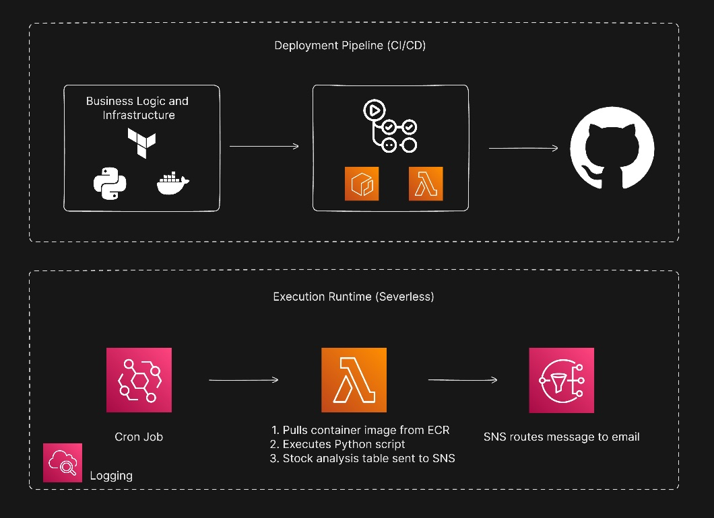

# 📈 Serverless Stock Analyst (Cloud-Native) 

An automated financial analyst that performs daily technical analysis (Golden Cross/Death Cross) and fundamental valuation (P/E Ratio) on a custom watchlist.

## 🏗️ Architecture

- **Trigger:** AWS EventBridge (Daily cron job)
- **Compute:** AWS Lambda (Python 3.11 / Containerized)
- **Image Registry:** AWS ECR
- **Messaging:** AWS SNS (Email notification)
- **IaC:** Terraform (Managed via HCP Terraform)
- **CI/CD** GitHub Actions

## 🚀 Deployment Features
- **Containerized Runtime:** Solves the 'Pandas-on-Lambda' dependency size issue.
- **FinOps Optimized:** Entire stack operates within the AWS Free Tier (or <$0.10/mo).
- **Automated Lifecycle:** ECR policies automatically prune old images to save storage costs.

## 🛠️ Setup
1. Define your watchlist in `src/app.py`.
2. Build and push the Docker image to ECR.
3. Run `terraform apply` to provision the event-driven triggers and notification system.